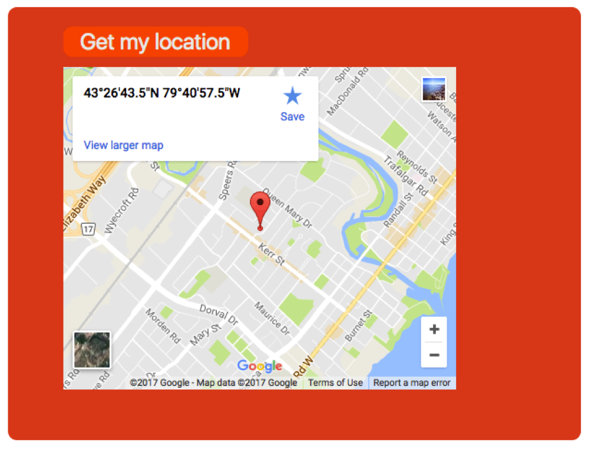
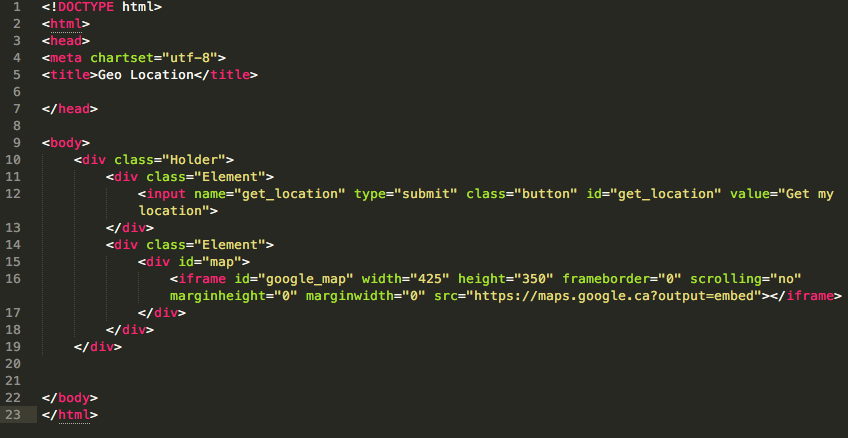
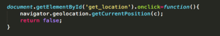
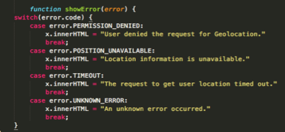
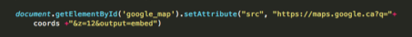
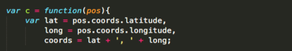
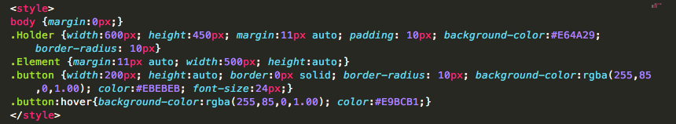

# geolocationAPI
Using the HTML5 Geolocation API, I built a simple app that requests the user's location and displays it on a Google map embeded within the application. 



<h3>HTML5 Geolocation API</h3>
The geolocation API provides developers with scripted access to geographical information associated with the hosting device. Essentially it has allowed developers to focus more on the data they can extract and how to use it, rather than how to get it. However due to some out-lying factors the results aren’t always super accurate, and there for, shouldn’t be 100% relied upon. 

<h3>Browser Compatibility</h3>
As of right now HTML5's geolocation compatability is as such: 

<h4>Desktop</h4>
  <ul>
  <li>Firefox 3.5+</li>
  <li>Chrome 5.0+</li>
  <li>Safari 5.0+</li>
  <li>Opera 10.60+</li>
  <li>Internet Explorer 9.0+</li>
  </ul>
  
<h4>Mobile</h4>
  <ul>
  <li>Android 2.0+</li>
  <li>iPhone 3.0+</li>
  <li>Opera Mobile 10.1+</li>
  <li>Symbian (S60 3rd and 5th generation) </li>
  <li>Blackberry OS 6</li>
  <li>Maemo</li>
  </ul>
  
  <h3>Geolocation Methods</h3>
  The geolocation object can be used within JavaScript to gather location information about the device through the browser, and it uses three public methods.
  
  <strong>getCurrentPostiion()</strong> :The get current position method does what you’d imagine it would, it grabs the coordinates of the devices location through the browser.</br>
  <strong>watchPosition()</strong> :The watch position method, updates the location at a set interval, so if the user was in a vehicle the location would change over time.</br>
  <strong>clearWatch()</strong> :The clear watch method, is what stops watch position method.</br>
  
  <h3>Geolocation and Privacy</h3>
  Due to the nature of the geolocation API, the browser will always request permission to access the user’s location. The get current position function is what makes a request through the user’s browser, it is here that they will see a pop up that will ask them if they’d like to share their location or not.
  
  <h3>How it works</h3>
  <p>Well for starters it's dependent on the browser, and from there it searches for numerous factors which include:</p>
<ul>
<li>IP address</li>
<li>Cell tower IDs</li>
<li>GPS information</li>
<li>WiFi access points</li>
<li>Signal strengths etc.</li>
</ul>
Then each browser uses it’s own location services, and an approximate location is then returned, via a JavaScript callback.

Where the user is, makes a difference as well. For example they will yield more accurate results if they're in an urban area, versus a rural one, or if they're stationary, versus moving. Users who use a VPN to alter their location, will also get inaccurate results. 

<h3>So let's get to the code!</h3>

<h4>Basic HTML comes first</h4>


Once you have your basic template set up, you're going to insert script tags into the body. 

<h4>And now for the JavaScript</h4>
You're going to want to use the getCurrentPosition() method, this will query the browser and will either run successfully, or will return an error to the user.



Here you can also use a switch statement to run through some common errors.



Once you've obtained the current position, there are a few different parameters that you can pass through as well: 

<ul>
<li><strong>enableHighAccuracy</strong> :enableHighAccuracy lets the API know that you want to get as close to the exact location as possible. The default value is false, as setting it true can lead to slower load times.
</li>
<li><strong>maximumAge</strong> :maximumAge lets the browser know that you only want to hold a cached position for a set time. If for example you were using watchPosition, having a cached position would hold onto previous locations momentarily. 
</li>
<li><strong>timeout</strong> :finally the timeout parameter, which indicates the maximum length of time that the callback function will wait.
</li>
</ul>

<h3>Loading the map</h3>
There are a couple of different ways to load a map into your application, in this demo I simply emedded one in the page. 



<h3>The final important piece</h3>
Here we manipulate the coordinates, and we put them into a single variable: 



<h4>You can also play with location properties</h4>

<ul>
<li>coords – specifies the coordinates of the device, which is expressed as latitude and longitude</li>
<li>coords.latitude – specifies the estimated latitude in decimal degrees</li>
<li>coords.longitude – specifies the estimated longitude in decimal degrees</li>
<li>coords.altitude – specifies the estimated altitude in metres</li>
<li>coords.accuracy – provides an estimate of the accuracy in metres</li>
<li>coords.altitudeAccuracy – provides and estimate of the accuracy of the altitude in metres</li>
<li>coords.heading – specifies the device’s current direction of movement in degrees counting clockwise, relative to true north</li>
<li>coords.speed – specifies the estimate of the devices ground speed</li>
<li>timestamp - gives the time when the location object was retrieved</li>
<ul>

<h3>A little CSS</h3>
here I've just included a little bit of css you can include, and manipulate.



<h3>Complete Code</h3>

```
<!DOCTYPE html>
<html>
<head>
<meta chartset="utf-8">
<title>Geo Location</title>

<style>
body {margin:0px;}
.Holder {width:600px; height:450px; margin:11px auto; padding: 10px; background-color:#E64A29; border-radius: 10px}
.Element {margin:11px auto; width:500px; height:auto;}
.button {width:200px; height:auto; border:0px solid; border-radius: 10px; background-color:rgba(255,85,0,1.00); color:#EBEBEB; font-size:24px;}
.button:hover{background-color:rgba(255,85,0,1.00); color:#E9BCB1;}
</style>
</head>

<body>
	<div class="Holder">
		<div class="Element">
			<input name="get_location" type="submit" class="button" id="get_location" value="Get my location">
		</div>
		<div class="Element">
			<div id="map">
				<iframe id="google_map" width="425" height="350" frameborder="0" scrolling="no" marginheight="0" marginwidth="0" src="https://maps.google.ca?output=embed"></iframe>
			</div>
		</div>
	</div>

	<script>

		var hereIAm = function(pos){
			var lat = pos.coords.latitude,
				long = pos.coords.longitude,
				coords = lat + ', ' + long;

			document.getElementById('google_map').setAttribute("src", "https://maps.google.ca?q="+ coords +"&z=12&output=embed")	

			console.log(lat);
			console.log(long);
		}
		
		document.getElementById('get_location').onclick=function(){
			navigator.geolocation.getCurrentPosition(hereIam);
			return false;
		}


	</script>
</body>
</html>
```


So there you have it your own working little geolcation app! Now go on an experiment and create wonders!


